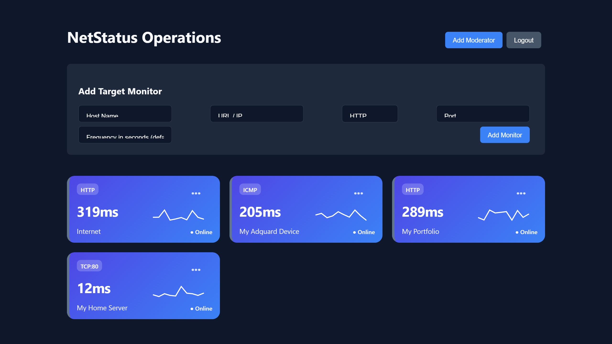
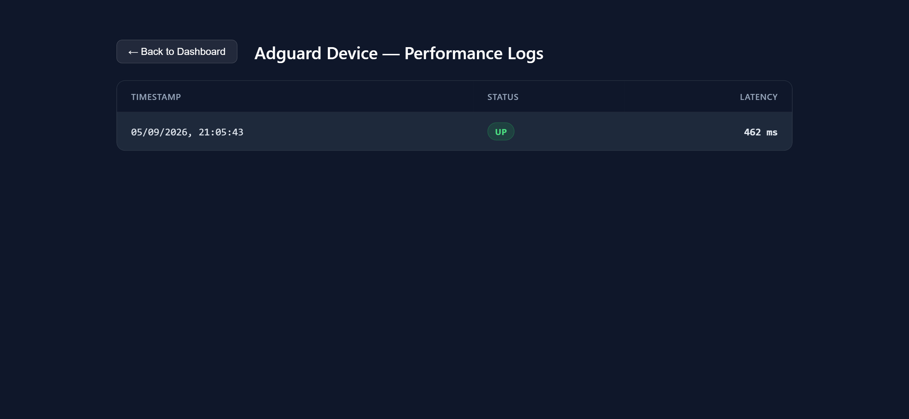

# ⚡ NetStatus — Web Dashboard

The web interface for **NetStatus**. Built with React and Vite, it displays real-time network telemetry, live latency sparklines, monitor management options, and detailed performance log histories.


---

## ✨ Features

- **Live Telemetry Cards:** Real-time host latency charts rendered with custom SVG sparklines over WebSockets.
- **Monitor Management:** Easily add, configure, and remove target HTTP, TCP, or ICMP monitors.
- **Performance Logs:** Clean performance log table displaying response statuses, timestamps, and exact latency timings.

---

## 🛠️ Tech Stack

- **Framework:** React 18, Vite
- **Styling:** Custom CSS / CSS Modules
- **Data Flow:** WebSockets (`ws`), REST API Integration

---

## 🚀 Getting Started

### 1. Prerequisites

- Node.js >= 20.0.0
- Running instance of [netstatus-backend](https://github.com/mouad-hachemi/netstatus-backend)

### 2. Installation

```bash
git clone https://github.com/mouad-hachemi/netstatus-frontend.git
cd netstatus-frontend
npm install
```

### 3. Environment Configuration

Create a `.env` file in the root directory:
```text
VITE_API_URL=your_netstatus_backend_url
VITE_WS_URL=your_netstatus_beckend_ws_url
```

### 4. Running the Frontend
```bash
# Development server.
npm run dev

# Production build.
npm run build
```

## 🔗 Related Repositories

- Backend Engine: [netstatus-backend](https://github.com/mouad-hachemi/netstatus-backend)

## Screenshots




## 📄 License

Distributed under the MIT License.